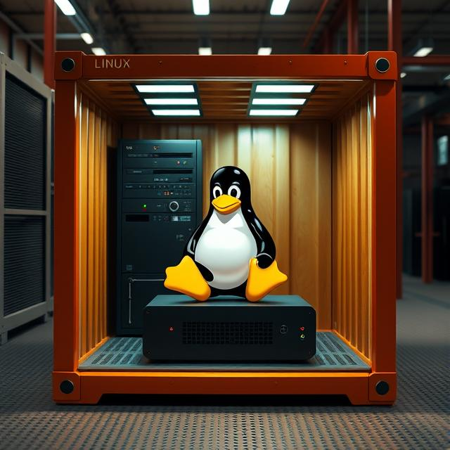

# DevOps Linux
<div style="text-align: center;">
    


</div>

## Repository

This source code is available to everyone under the standard [0BSD License](LICENSE.txt) to allow every setup configuration in every way possible, commercial background or not. Some of the scripts in this project **will** destroy all data on your system. So be careful and use a testing lab first! Common sense, people. **I will not take any responsibility for any of your lost files!**

## Build Environment

Your build environment should include the following programs:
- **packer** for automation,
- **swtpm** for TPM emulation,
- **cloud-image-utils** to package the complete build chain into a single mime-multipart user-data file,
- **xorriso** to repackage the Arch ISO,
- **yq** for config file parsing, and
- **qemu-desktop** (Arch) / **qemu-system-x86_64** (Debian/Ubuntu) for virtualization.

The project has the following folder structure:
- **📁build** - in this folder all the files are prepared before they are placed inside the Arch ISO
- **📁config** - the main folder containing all the python, setup and config files
- **📁config/📄setup.yml** - central configuration file describing all the files that are needed for the installation
- **📁database** - a temporary folder for package caching, allowing for installations where no internet is available to use a local package cache from previous installations
- **📁output** - the final artifacts are placed inside this folder
- **📁output/artifacts/docker** - the produced docker image is placed here
- **📁output/artifacts/pxe** - the produced files for pxe booting are placed here
- **📁output/devops-linux** - the produced virtual machine is placed here
- **📁output/devops-linux/devops-linux-x86_64.run.sh** - the main executable script for the produced virtual machine
- **📄cidata.sh** - preparation script to package the files needed for CIDATA execution of cloud-init
- **📄pipeline.sh** - this script will start the whole setup pipeline

Supported cloud images are Arch, Ubuntu, Debian and Rocky Linux, although Rocky is not well tested, as I mainly utilize Arch for clients and Debian for servers.

## Config File Structure

**📁config/📄setup.yml**
```yaml
## Mapping distros to their packaging tools (debian -> apt, rocky -> yum, ...)
distros:
  [...]
## Where to download the corresponding qcow2 image
## "archiso" is an exception as the entry maps to the Arch ISO download link
download:
  [...]
## End of life for all the distro package versions. Will print an error and abort the setup
## when no support is to be expected from the maintainers any more.
endoflife:
  [...]
## The file name of the downloaded image
images:
  [...]
## setup files per stage and packaging tool
## format: [packaging tool] -> [setup name] -> [path/stage/config file]
files:
  [...]
## setup instructions
setup:
  ## chosen distro name
  distro: [...]
  ## which files to install via setup name and distro
  options:
    - [...]
  ## legacy entry to define environment variables. I'm not sure whether it should be marked deprecated or not.
  env_vars:
    - [...]
  ## the path to the target device to write the cloud image onto. "auto" tries to find a hard drive on it's own, but errors out when nothing is found.
  target: auto
  ## (local) mirror link to the base of archive.archlinux.org
  archiso_mirror: false
  ## (local) package mirror link
  pkg_mirror: false
  ## (local) Chaotic Arch user repository mirror link
  chaotic_mirror: false
```

At this point the following options can be selected for installation:

- **base** (_all_): Some programs installed for ease of use, performing most of the tasks inside the terminal. The graphics drivers for the most common (virtual) GPUs are placed here, too. They are not needed for the essential basics.
- **mirror** (_all_): Local mirrors for all supported distributions, downloading updates every couple of days for all the packages while keeping the last two or more versions accessible. Instead of using the official default route, we iterate over all available packages, retrieve the download urls and instead of using apt or pacman for the job we download all packages through wget, allowing to timestamp every file and force "304 Not Modified" messages. This method is so much faster and more efficient than the throttled and overrun rsync connections and allows for local repositories that are not officially supported by the vendor.
- **cinnamon** (_Arch_): Install the fully configured [cinnamon](https://github.com/linuxmint/cinnamon) desktop, including graphical tools like office programs, video players, etc.
- **kde** (_Arch_): Install the fully configured [kde plasma](https://kde.org/de/plasma-desktop/) desktop, including some default kde applications, excluding unneeded utilities like "plasma-welcome", "kongress", "kteatime" and such.
- **podman** (_Arch, Debian, Ubuntu_): A docker replacement, that is fully compatible with all commands and hubs, and the new modern way to handle containers. In addition, [portainer](https://www.portainer.io/) is installed for easy container management via browser.
- **postgres** (_Arch, Debian, Ubuntu_): Install [postgres](https://www.postgresql.org/) as a container.
- **cronicle** (_Arch, Debian, Ubuntu_): Install [cronicle](https://github.com/jhuckaby/Cronicle) as a container.
- **dagu** (_Arch, Debian, Ubuntu_): Install [dagu](https://github.com/dagu-org/dagu) as a container.
- **plex** (_Arch, Debian, Ubuntu_): Install [plex media server](https://www.plex.tv/) as a container including shared gpu passthrough and configuration of the host.
- **minecraft** (_Arch, Debian, Ubuntu_): Install [minecraft](https://www.minecraft.net/de-de) as a container.
- **gitlab** (_Arch, Debian, Ubuntu_): Install [gitlab](https://about.gitlab.com/) as a container.
- **router** (_Arch_): A fully functional virtual router with DHCP4, DHCP6, DNS, NTP, PXE boot and ACME certificate authority. Connect the router through ```-netdev socket,listen=...``` with subsequent virtual machines ```-netdev socket,connect=...```.
- **proxmox** (_Debian_): Install [proxmox](https://www.proxmox.com/en/) to configure and spawn virtual machines and LXC container via gui.
- **podman-image** (_Arch, Debian_): As the final step, take everything that was configured before and generate a fully functional OCI container, that can be uploaded to any docker or podman instance.
- **pxe-image** (_Arch, Debian_): As the final step, take everything that was configured before and generate a fully functional pxe boot image, that can e.g. be used in conjunction with the router option above to netboot any device on the LAN. The Arch PXE image is able to be booted via CIFS, HTTP, ISCSI, NBD, NFS, NVMEOF and SCP (never saw that one before, right? 😉).

## Common Setups (by me)

### Setup #1: PXE image with kde and basic tools
```yaml
setup:
  distro: archlinux
  options:
    - base
    - kde
    - pxe-image
```

### Setup #2: Router to host the pxe image produced by #1 for testing
```yaml
setup:
  distro: archlinux
  options:
    - base
    - router
```

### Setup #3: Proxmox server
```yaml
setup:
  distro: debian
  options:
    - base
    - proxmox
```

### Setup #4: Archlinux and Debian local mirror
```yaml
setup:
  distro: archlinux
  options:
    - mirror

setup:
  distro: debian
  options:
    - mirror
```

### Setup #5: Build a minimal Arch Linux or Debian container 
```yaml
setup:
  distro: archlinux
  options:
    - podman-image

setup:
  distro: debian
  options:
    - podman-image
```

### Setup #6: Podman server to host dagu for automation
```yaml
setup:
  distro: debian
  options:
    - base
    - podman
    - dagu
```

## License

Licensed under the [0BSD](LICENSE.txt) license.